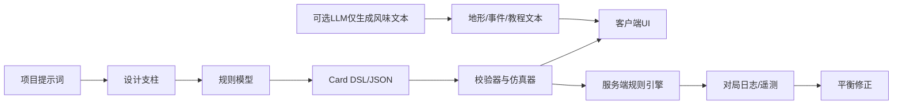

# 拿破仑战争卡牌游戏可执行研究报告

## 执行摘要

项目提示词把目标定义得很清楚：做一款受 [Prompt.md](sandbox:/mnt/data/Prompt.md) 启发、以拿破仑战争为题材、优先面向 PC 与 Steam 首发的数字卡牌对战游戏，并且要求结论明确、调研服务机制而不是服务空泛历史叙述。按这个约束看，这个项目**能做，但前提是先砍掉三件最容易把项目拖死的事**：MVP 阶段不做自由混战多方对战、不做完整海战副系统、不做“AI 直接决定规则”的伪创新。你给出的方向里，真正有市场窗口的是“**历史题材 + 低学习门槛 + 中等策略深度 + 强可读性美术**”，而不是“把 entity["video_game","KARDS","wwii ccg"]、entity["video_game","Artifact Classic","valve card game"]、桌游外交、多人混战和大地图会战一次性揉在一起”。citeturn7view0turn31search2turn9search0turn9search1

| 关键决策 | 明确建议 | 原因 |
|---|---|---|
| MVP 对战模式 | **方案 A：只做 1v1** | 现有数字 CCG 的成功样本几乎都把核心资源放在 1v1 可读性、平衡和留存上；即便是复杂到三线并行的 Artifact，在 1v1 都已经显著抬高认知负荷。citeturn27search1turn31search2turn34view0turn34view1 |
| 战场结构 | **选“地形”方案，而不是三线方案** | 拿战确实适合“散兵线/主力线/后方”想象，但三线会直接把牌局信息密度推高并恶化新手体验。更稳妥做法是“一条主战线 + 一个支援区 + 一个公共地形槽”。这保留历史味道，又不把局面做成 Artifact 式过载。citeturn27search1turn31search0turn7view0 |
| 首发阵营数 | **5 个，不是 6–8 个** | 法、英、普、俄、奥足以覆盖攻击、消耗、改革、防守、海权/经济五种轮廓；西班牙更适合作为事件包/首个主题扩展。 |
| 海战 | **不做独立模式，先做事件牌与少量海军单位** | 特拉法加、尼罗河不能缺席，但如果做完整海战，就是第二套战斗系统，直接吃掉 MVP。citeturn22search7turn22search19 |
| 美术 | **海报化漫画风** | 同时代绘画可提供构图、制服和色彩参考，但真正适合长期内容生产和 Steam 缩略图传播的，仍然是“KARDS 路线的高可读海报化”。citeturn25search9turn25search2turn30search11 |
| 商业化 | **F2P + 创始人包 + 月度战令** | 头部与存活样本大多仍依赖 F2P 与持续更新；KARDS 官方战令就是月度制，卡池与运营也明显偏长期服务。citeturn30search1turn30search17turn34view0turn34view1turn34view2 |
| 上线策略 | **试玩节 Demo → Early Access → 1.0** | Steam 官方把 Early Access 和 Next Fest 都定位为“拿可玩版本换真实反馈”，这比闭门堆内容更适合卡牌游戏。若 2026 年 6 月 15–22 日前能做出垂直切片，可冲一次 Next Fest；否则等下一档，不要赶工。citeturn9search0turn9search1turn9search5 |

市场侧最重要的现实是：当前 Steam 上，entity["video_game","MARVEL SNAP","card game 2023"]约有 2,784 名实时玩家、entity["video_game","GWENT: The Witcher Card Game","card game 2020"]约 511、KARDS 约 1,204、entity["video_game","Eternal Card Game","dire wolf ccg"]约 134，而 entity["video_game","Mythgard","monumental ccg"]只剩约 4；Artifact Classic 虽然历史峰值达到 60,646，但现在只有约 22 名实时玩家。这说明卡牌市场并没有“历史题材就没机会”的问题，真正的问题是：**复杂度、入门门槛、商业化 friction 和长期内容生产效率**。citeturn34view0turn34view1turn7view0turn34view2turn35view0turn7view1

我对你原始提示词里最值得质疑的两点是：第一，**“1–3 分钟主对局”过于激进**。那是 Marvel Snap 的节奏，不是带兵种克制、地形和拿战 flavour 的中量级 CCG 节奏。更现实的目标是 **4–6 分钟标准局**，再额外做 1–3 分钟的残局/征服/历史战役短局。第二，**“MVP 包 6–8 个势力”不划算**。从内容量、平衡矩阵和 QA 成本看，5 势力才是现金流友好型决定。citeturn31search0turn31search4turn7view0

## 提示词解读与产品假设

你已经**提供了提示词**，但它的类型不是“玩家在游戏里输入的自然语言提示词”，而是“**立项与调研型产品提示词**”。也就是说，当前文件定义的是**你想做什么游戏**，不是**玩家在游戏里怎么和系统对话**。这点必须先分开，否则技术路线会被带偏。

| 提示词类别 | 状态 | 在本项目中的作用 |
|---|---|---|
| 立项提示词 | **已提供** | 定义题材、平台、竞品、里程碑、风险边界。 |
| 机制提示词 | **已提供** | 明确要调研行动点、战场结构、多方对战、兵种克制。 |
| 美术提示词 | **已提供** | 限定为拿战视觉语汇，并要求从 David / Gros / Goya 等方向取材。 |
| 叙事提示 | **未直接提供** | 未来可用于战役事件、历史分支、将领口白。 |
| 任务提示 | **未直接提供** | 未来可用于“征服模式”“战役目标”“教程任务”。 |
| 环境提示 | **未直接提供** | 未来可用于地形、天气、补给线、战场事件文本。 |
| NPC 对话提示 | **未直接提供** | 未来可用于将领播报、战后总结、战役 Briefing。 |
| 谜题提示 | **未直接提供** | 可转译为“历史残局”或“本回合致胜”挑战，而非传统谜题。 |
| 生成式艺术提示 | **未直接提供** | 只适合前期 mood board 与草图探索，不宜直接作为最终商业卡面主生产线。 |

因此，本项目里“提示词驱动”最合理的定义，不是让玩家打字决定规则，而是让系统内部存在一套**文本提示层**：教程提示、事件提示、地形提示、将领对话提示、UI 决策提示。**PvP 规则必须是确定性的；AI 只能生成风味文本、任务包装和草案，不应生成判定逻辑。**这是避免反作弊、平衡崩盘和本地化灾难的底线。citeturn19view0turn19view1turn17view0turn17view2turn14search0turn16view0



## 对标研究与交互启发

先给结论：你的产品最该学习的，不是“哪个游戏最像拿战”，而是**哪套交互机制能在 Steam 上长期存活**。目前能验证的样本说明，能活下来的数字卡牌游戏有三个共同点：**局面读得懂、对局节奏稳定、长期内容生产能跟上**。反过来，失败样本通常死在其中两个以上。citeturn34view0turn34view1turn7view0turn34view2turn35view0turn7view1

| 游戏/系统 | 平台 | 提示词或类似机制 | 实现技术/核心机制 | 用户体验要点 | 参考 |
|---|---|---|---|---|---|
| **entity["video_game","KARDS","wwii ccg"]** | PC / 移动 | 战线、单位关键字、盟国构筑、月度战令 | Frontline / Support Line、单位关键字、盟国牌组；官方写明战令按月运行，活跃卡池约 800 张 | “战争”主题和 CCG 规则结合得最自然，但它的 WWII 语义不能直接平移到拿战。你该学它的可读性、牌面信息层级和持续运营节奏，不该照抄信用与战线模型 | 官网/帮助中心 citeturn30search11turn30search1turn30search17turn30search6turn7view0 |
| **entity["video_game","MARVEL SNAP","card game 2023"]** | PC / 移动 | “地点”就是每局动态提示 | 12 卡牌组、3 分钟短局、地点文本驱动局部规则 | 最适合借鉴的是“每局一个可读 gimmick”，也就是本项目的地形槽；但不要误以为你也必须硬压到 3 分钟 | 官网/Steam/SteamDB citeturn31search4turn31search0turn34view0 |
| **entity["video_game","GWENT: The Witcher Card Game","card game 2020"]** | PC / 主机 / 移动 | 回合推进、弃牌与 Pass 是核心“决策提示” | 三回合制、强节奏博弈、持续社区更新 | 如果你要做“士气/军令”而不是纯费用曲线，Gwent 的节奏与 Pass 心理值得学；它证明“可读决策张力”比花哨系统更有价值 | 官网/SteamDB citeturn31search9turn31search1turn34view1 |
| **entity["video_game","Artifact Classic","valve card game"]** | PC | 三线并行、同一手牌跨线调度 | 三线战场、复杂优先权、市场化商业模型 | 这是 MVP 不该学的方向：三线让 1v1 本身就信息过载，外加商业化摩擦，导致口碑与留存双崩。Valve 后续也把 Foundry 定义成“streamlined gameplay” | Steam / 评测 / SteamDB citeturn31search2turn27search1turn7view1 |
| **entity["video_game","Eternal Card Game","dire wolf ccg"]** | PC / 主机 / 移动 | 数字化规则速度快，构筑深度高 | 深策略、快结算、长期 F2P | 它说明“做深做快的 1v1”是可行路线，但它也说明不是所有扎实产品都能长成头部；题材识别度和传播点仍然重要 | 官网/SteamDB citeturn26search4turn31search3turn34view2 |
| **entity["video_game","Mythgard","monumental ccg"]** | PC / 移动 | 车道/法力与双人协作提示 | 独特 lane 与 mana 系统，且支持 team play | 它是重要反例：机制和评价都不差，但活跃度极低，说明“系统特色”不自动转化为商业留存 | SteamDB citeturn35view0 |

### 为什么我不建议 MVP 做多方混战

这是这份报告最重要的机制判断。你的提示词里把“多势力交战”当作创新点，但数字 CCG 里**“多势力题材”**和**“多人混战玩法”**根本不是一回事。前者可以通过阵营、事件、地形和外交 flavour 呈现；后者会显著放大四个成本：等待时间、状态同步、平衡矩阵、UI 可读性。

- Artifact 的 1v1 三线已经证明：当单局信息面板超出玩家一次扫视能理解的能力时，哪怕核心设计者很强，产品也会把用户筛掉。citeturn27search1turn31search2turn7view1  
- Eternal、Gwent、Marvel Snap、KARDS 这些仍有活跃度的样本，核心都稳稳站在 1v1 上，说明市场主流并没有把“多人混战”当留存主驱动。citeturn34view0turn34view1turn7view0turn34view2  
- 你提示词里要求调研 HEX 的多方路线，但当前我拿到的一手信息只能确认它当年主打“TCG + online RPG”、单人模式、PvP、1000+ cards 这类大而全定位；**我没有抓到足够可靠的官方失败复盘**，所以不能负责任地把它的结局简单归因为“多人没跑通”。能确定的教训只有一个：**范围过大本身就是风险。**citeturn29search9

因此，MVP 的推荐路线是：

- **MVP：1v1 排位 / 休闲 + AI 对练 + 本地热座**
- **1.5：2v2 团队战或历史阵营赛季活动**
- **2.0 以后再讨论 3–4 人混战**

### 对你的产品真正有价值的交互结论

最适合拿战题材的，不是更复杂的板面，而是更清晰的“战场条件提示”：

- 将 **地形** 做成每局公共规则牌，等价于 Marvel Snap 的“地点”，但呈现为“平原 / 村镇 / 山地 / 湿地 / 要塞 / 雪地”。  
- 将 **士气** 做成副资源或状态，而不是第二种“法力”。否则规则层会变脏。  
- 将 **海战** 做成事件与支援体系，而不是切出第二套棋盘。  
- 将 **历史人物** 做成“将领卡/统帅能力”，而不是复杂谈判代理。  

这条路线既能保住题材差异化，也不会复刻 Artifact 式操作负担。citeturn31search0turn31search4turn27search1

## 技术实现分析

### 引擎与平台栈

| 技术栈 | 优点 | 缺点 | 成本与授权 | 性能 / 隐私 | 结论 |
|---|---|---|---|---|---|
| **entity["company","Unity Technologies","game engine vendor"] / Unity** | C# 对卡牌、UI、编辑器工具链友好；多平台覆盖强；生态成熟 | 运行体量偏重；团队如果只会脚本层，容易把项目做成“堆组件” | Personal 免费，适用于过去 12 个月收入/融资低于 20 万美元；Pro 为 210 美元/月/席位 | 适合 PC 首发、后续移植；多人配合 UGS、Mirror、Photon 都成熟 | **标准商业版首选**。citeturn33view4turn33view5turn33view6 |
| **entity["organization","Godot Engine","open source engine"]** | MIT 许可、零授权费、2D 轻量、Web 导出方便 | 商业级 live-ops、现成 CCG 生态与工具链弱于 Unity | MIT 免费 | Web 导出要求 WebAssembly + WebGL 2；非常适合快速样机 | **轻量原型首选**，商业版可做但会多造一些轮子。citeturn10search2turn10search6turn32search1turn32search5 |
| **entity["company","Epic Games","unreal engine vendor"] / Unreal** | 演出、3D、材质和工具链强；源码可得 | 对 2D CCG 明显过重；UI 工具和内容生产效率不如 Unity 直觉 | 终端产品累计收入超过 100 万美元后，超出部分 5% 抽成 | 适合重演出牌桌，不适合你的 MVP 速度目标 | **不建议做本项目 MVP 主栈**。citeturn33view3turn32search2turn32search10 |
| **Web / Phaser** | 原型极快、分享和试玩门槛低、适合 Demo | 原生桌面分发、Steam 集成、复杂动画与重资产管理不如 Unity 顺手 | Phaser 免费开源 | 浏览器天然方便测试，但长期内容工具链要自己补 | **非常适合试玩节 Demo 或验证地形/兵种规则**。citeturn32search0turn32search4turn32search8 |

### 联机、对话系统与状态管理

| 模块 | 可选方案 | 优点 | 缺点 | 成本 / 风险 | 建议 |
|---|---|---|---|---|---|
| 联机 | Mirror | 开源、Unity 生态常见、可控 | 需要自己搭后端与权威逻辑 | 工程人力成本高 | 只适合团队后端能力强的情况。citeturn10search3turn10search14 |
| 联机 | Unity Relay / Lobby | 入门简单；前 50 平均月 CCU 免费，之后 Relay 约 0.16 美元/额外平均 CCU，另计带宽 | 最终成本随 DAU/带宽上升 | 适合前期试水 | 可做 Alpha / Beta 联机。citeturn33view1 |
| 联机 | Photon Fusion | 专门做实时/同步，100 CCU 免费；500 CCU 起约 125 美元/月 | 供应商锁定；规则服务端权威仍要自己写 | 成熟但偏 SaaS | **若做正式 PvP，优先考虑**。citeturn12search0turn12search8 |
| 联机 | PlayFab Multiplayer | 有免费起步配额，标准版 99 美元/月，含 400 美元量级的月度 included meters | 文档与 Azure 体系更重 | 适合长线 live-ops | 商业版可作为后期服务端方案。citeturn33view2 |
| 对话 / 战役文本 | Ink | 文本优先、Unity/Unreal 集成、MIT、适合分支事件 | 偏作者工具，不是战斗规则引擎 | 很低 | **推荐做战役、征服、历史事件**。citeturn19view1turn19view2turn19view3 |
| 对话 / 战役文本 | Yarn Spinner | Unity 场景集成、变量与本地化流程清晰 | 比 Ink 更“系统组件式” | 很低 | 如果你更强调编辑器工作流，可选它。citeturn19view0 |
| 状态管理 | 纯数据驱动 Card DSL + 确定性规则引擎 | 最利于平衡、回放、反作弊、A/B | 前期要先搭 DSL 与校验器 | 一次性工程投入高 | **本项目必须采用**。 |
| 状态管理 | 直接在卡牌 prefab / 脚本里写逻辑 | 快 | 卡越多越难维护 | 技术债极高 | **不要这样做**。 |

### 自然语言 / 生成能力

| 路线 | 适用环节 | 优点 | 缺点 | 成本与隐私 | 结论 |
|---|---|---|---|---|---|
| 纯模板 / 规则文本 | 卡面规则、UI、战报 | 100% 可控、可本地化、零额外成本 | 风味文本容易“像表格” | 最安全 | **MVP 必选** |
| Ink / Yarn + 模板变量 | 战役、事件、教程 | 能做分支叙事、变量跟踪、本地化清晰 | 需要编剧/叙事设计 | 成本低 | **推荐作为非 PvP 文本层**。citeturn19view0turn19view1 |
| 本地模型：Ollama / llama.cpp | 风味文本、工具内草案生成 | 隐私好，可本地 API；Ollama 支持本地 GPU，模型占用从数十 GB 到更高 | 质量不稳定，机器要求高，运维归你自己 | 本地 Windows 安装至少需 4GB 安装空间，模型可占 tens to hundreds of GB；本地硬件成本高但边际调用成本低 | **适合内部工具，不适合 MVP 线上实时规则**。citeturn17view0turn17view1turn17view2 |
| 云 API：entity["company","OpenAI","ai company"] / entity["company","Anthropic","ai company"] | 风味文本、策划草案、客服/运营工具 | 质量高，接入快 | 数据出境、调用成本、缓存与审计要求 | OpenAI 当前公开价中，GPT-5.4 mini 为输入 0.75 美元/百万 token、输出 4.5 美元/百万 token；Anthropic Claude Haiku 4.5 为输入 1 美元/百万 token、输出 5 美元/百万 token | **只建议做后台内容工具或高级版功能，不要让模型决定结算逻辑。** citeturn14search0turn16view0 |

### 内容生成管线与资产工具

你提示词里写了“JSON/YAML 数据驱动 + Lua 行为脚本”，这个方向是对的，但我会收紧成：**MVP 先 JSON/YAML + C# 效果枚举 + 少量脚本钩子；Lua 放到 1.5 再引入。**  
原因很简单：先解决“卡牌规则的可验证性”，再解决“脚本的灵活性”。卡牌游戏最贵的不是写代码，而是**验证数百张牌在数万种组合下不会炸**。

| 工具 | 角色 | 结论 |
|---|---|---|
| **entity["organization","Blender","3d software"]** | UI 3D 场景、棋盘、镜头物件、特效底模 | 免费开源，适合做牌桌、棋盘和简单兵模，不需要替代手绘卡面。citeturn20search0turn20search8 |
| **entity["organization","Krita","digital painting app"]** | 原画、海报化卡面草图、UI 绘制 | 免费开源，适合作为主绘画工具之一。citeturn20search1turn20search5turn20search9 |
| **entity["organization","Spine","2d skeletal animation"]** | 2D 骨骼动画、UI 角色待机 | Pro 当前公开价约 379 美元/用户；适合做统帅立绘与 UI 动效，不要全项目重度依赖。citeturn20search6turn20search18 |
| **entity["organization","FMOD","audio middleware"]** | 动态音频、战场音效状态切换 | Indie 许可对年收入低于 20 万美元、开发预算低于 60 万美元团队可免费；适合做士气、鼓点、炮火层叠。citeturn21search0turn20search3 |

## 开发流程与里程碑

下面给的是“从原型到 Steam Early Access”的**现实排期**，不是乐观排期。预算未指定，因此我以“独立团队/小工作室”常见组织方式估算。

| 阶段 | 周期 | 关键产出 | 小型团队 | 中型团队 |
|---|---|---|---|---|
| 预制作 | 2–3 周 | 核心规则白皮书、5 阵营定义、Card DSL 草案、视觉方向板 | 制作人 1、主策 1、程序 1、美术 1；约 320–400 工时 | 制作人 1、主策 1、系统策 1、程序 2、美术 2；约 480–640 工时 |
| 可玩原型 | 4–6 周 | 40–60 张测试牌、地形槽、AI 占位、单局回放、日志系统 | 程序 2、策划 1、美术 1、QA 0.5；约 800–1,100 工时 | 程序 3、策划 2、美术 2、QA 1；约 1,200–1,600 工时 |
| 垂直切片 | 6–8 周 | 首发 5 阵营骨架、120–150 张牌、基础 UI、教程、音频风格样本 | 6–7 人；约 1,200–1,600 工时 | 9–10 人；约 1,800–2,400 工时 |
| Alpha 内容生产 | 8–10 周 | 200–240 张牌、征服模式雏形、平衡工具、匹配原型 | 7–8 人；约 1,600–2,000 工时 | 10–12 人；约 2,400–3,200 工时 |
| Beta / Demo / 试玩节 | 4–6 周 | Steam Demo、封测、遥测埋点、首轮平衡 | 7–8 人；约 900–1,200 工时 | 10–12 人；约 1,400–1,900 工时 |
| Early Access 准备 | 4–6 周 | 商店页、经济系统、战令、创始人包、反作弊与客服流程 | 7–9 人；约 900–1,200 工时 | 10–14 人；约 1,400–2,000 工时 |

**总计**：  
- 小型团队：约 **28–39 周，5,700–7,500 工时**。  
- 中型团队：约 **24–33 周，8,700–11,700 工时**。  

如果你坚持在 MVP 里加入 2v2，排期至少再增加 20–30%；如果加入 3–4 人混战或独立海战，排期会直接变成第二个项目。这个不是悲观，是经验判断。citeturn9search0turn9search1

### 建议里程碑顺序

1. **先把 1v1 核心循环做通**：抽牌、出牌、移动/部署、结算、死亡、胜负。  
2. **再加地形槽和 5 阵营轮廓**。  
3. **再做经济系统、卡池和教程**。  
4. **最后做服务化、战令、商店与联机工程化**。  

如果顺序反过来，项目会很快变成“商店和服务器很完整，但牌不好玩”。

## 方案集与预算情景

预算当前为**未指定**。下面给的是带假设的可执行情景，币种采用**人民币粗估**，不含大 IP 授权、外包 CG 片和主机认证成本。

| 方案 | 功能清单 | 关键技术 | 预算范围 | 时间线 | 主要风险 | 缓解措施 |
|---|---|---|---|---|---|---|
| 轻量原型 | 1v1、本地热座、AI 占位、2 阵营、40–60 牌、无联机经济 | Godot 或 Unity Personal、JSON DSL、纯模板文本 | **15万–35万元** | 8–12 周 | 原型能玩但“不像商品” | 只验证地形、兵种克制、牌速，不碰商店与长期运营 |
| 标准商业版 | 1v1、5 阵营、200–240 牌、教程、征服模式雏形、Steam Demo、Early Access | Unity、权威规则引擎、Photon/PlayFab 二选一、Ink/Yarn 战役文本 | **120万–250万元** | 8–12 个月 | 卡池不足、平衡迭代慢、内容生产拖延 | 缩到 5 阵营；战役文本模板化；先 EA 再慢慢扩池 |
| AI 驱动高级版 | 在标准版基础上增加 AI 风味文本、智能教程、可变任务、内部策划 Copilot | Unity + LLM 工具链 + 缓存 + 审计系统 + 本地/云混合 | **250万–500万元** | 12–18 个月 | 规则漂移、隐私与审核、运维复杂度爆炸 | AI 只生成风味和草案；所有 PvP 规则仍由 DSL 与服务器裁定 |

我的建议非常明确：**先做“标准商业版”的删减版，也就是“可 EA 的中量级产品”**。  
不要在第一年碰“AI 驱动高级版”，因为你的题材与机制难点根本不在生成文本，而在**阵营差异化、兵种克制、节奏控制、长期平衡**。

## 交互、测试与关键实现

### 交互与 UX 建议

**提示设计原则**

- 一条提示只表达一个决策。不要把“地形效果 + 兵种克制 + 额外触发”塞进一行小字。  
- 机制文本必须先于风味文本。风味放在副层，规则放在主层。  
- 每张牌同时提供 **文字、图标、颜色、战场高亮** 四层反馈，不要把规则只交给字。  
- 地形和统帅能力应该始终可见，不要做成 hover 才能读到的隐藏状态。  
- 行动后要有“预期—执行—结果”三段式反馈：我会造成什么、系统怎么结算、实际发生了什么。  

**可视化与音效**

- 美术采用海报化卡面，但构图参考 entity["people","拿破仑·波拿巴","french emperor"] 时期宣传画，色彩参考同代绘画；  
- 法、英、普、俄、奥五阵营要有**色彩 + 图形**双重识别，不能只靠颜色，否则色弱玩家会痛苦；  
- 音效别搞成“纯军鼓轰炸”。鼓点、号角、火炮、马蹄应分层，并且允许玩家单独关闭高频提示。  
- 暴行题材不要视觉直给，尤其是半岛战争与奴隶制议题；更适合通过事件文本和战后摘记呈现。citeturn22search2turn22search5turn24search1turn24search3

**可访问性与本地化**

- 所有关键状态必须支持图标冗余。  
- 中文、英文、德文文本长度差异大，卡面布局必须预留扩展。  
- 将领语音和旁白可后置，首发先做文本本地化。  
- 不要把历史专有名词塞得太满；“哥萨克”“胸甲骑兵”这类名词要配悬浮释义。  

### 测试与迭代计划

| 指标 | MVP 目标 | 用途 |
|---|---|---|
| 新手教程完成率 | > 75% | 检查规则说明是否过载 |
| 首局对战完成率 | > 70% | 检查首局压力是否过高 |
| 中位对局时长 | **4–6 分钟** | 验证节奏是否兼顾策略与传播性 |
| 回合平均思考时间 | < 12 秒 | 检查信息密度是否失控 |
| 地形/事件触发成功率 | > 99% | 核心系统稳定性 |
| 结算反序列化 / 重放成功率 | > 99.5% | 反作弊与回放能力 |
| 新手 7 日留存 | > 10–15% | Steam F2P 早期健康线 |
| 首周每用户构筑次数 | ≥ 2.5 | 判断构筑乐趣 |
| T1 牌组出场占比 | < 18% | 防止环境单一 |
| 第 4 回合前投降率 | < 15% | 防止雪球太快 |

**建议 A/B 测试**

- 地形始终展示 vs 点击展开  
- 标准资源曲线 vs 更平缓资源曲线  
- 所有阵营初始可玩 vs 逐步解锁  
- 创始人包主 CTA vs 战令主 CTA  
- “历史真实名词”文案 vs “更口语化解释”文案  

### 示例实现片段

#### 提示词解析与卡牌 schema 校验

```ts
// TypeScript 伪代码：卡牌定义必须先结构化，再进入客户端/服务端
type CardDef = {
  id: string;
  faction: "FR" | "GB" | "PR" | "RU" | "AT" | "NEUTRAL";
  type: "UNIT" | "ORDER" | "LEADER" | "EVENT";
  cost: number;
  stats?: { attack: number; hp: number };
  tags: string[];        // e.g. ["line_infantry", "charge", "morale_gain"]
  effects: EffectDef[];  // 只允许引用白名单效果
  promptText: string;    // 仅用于UI展示，不参与权威结算
};

function validateCard(card: CardDef): string[] {
  const errors: string[] = [];
  if (!card.id) errors.push("missing id");
  if (card.cost < 0 || card.cost > 10) errors.push("invalid cost");
  for (const e of card.effects) {
    if (!ALLOWED_EFFECTS.has(e.kind)) errors.push(`unknown effect ${e.kind}`);
  }
  return errors;
}
```

#### 提示到行为映射

```csharp
// C# 伪代码：文本只是提示，真正结算永远由规则枚举驱动
public void ResolveTerrainModifier(BattleState state, Unit unit) {
    switch (state.SharedTerrain) {
        case Terrain.Plain:
            if (unit.HasTag("cavalry")) unit.AttackBonus += 1;
            break;
        case Terrain.Town:
            if (unit.HasTag("line_infantry")) unit.DefenseBonus += 1;
            break;
        case Terrain.Hills:
            if (unit.HasTag("artillery")) unit.RangeBonus += 1;
            break;
        case Terrain.Mud:
            if (unit.HasTag("heavy_cavalry")) unit.MoveCost += 1;
            break;
    }
}
```

#### 与生成模型交互的安全边界

```python
# Python 伪代码：LLM 只生成风味文本，不生成规则
def generate_flavor(card_name: str, faction: str, role: str) -> str:
    system = """
    You write short historical-flavor card lines.
    Never invent gameplay rules.
    Output <= 40 Chinese characters.
    """
    user = f"卡名:{card_name}; 阵营:{faction}; 角色:{role}"
    result = call_model(system=system, user=user)
    return sanitize_text(result)

def build_card_runtime(card_def):
    return {
        "rules": card_def["effects"],       # 权威规则
        "ui_text": card_def["promptText"],  # 设计师文本
        "flavor": cache_or_generate(card_def["id"])
    }
```

这三段代码其实表达的是同一件事：**把“可读文本”与“可执行规则”物理分离**。这是你项目以后能不能扩卡、回放、做反作弊、做国际化的生死线。

## 推荐资源与优先参考来源

### 优先级最高

- **官方产品与平台文档**：KARDS 官网与帮助中心、Steamworks 的 Early Access / Next Fest / Workshop / 成就文档、Unity / Unreal / Godot 官方授权与部署文档。citeturn30search11turn30search1turn30search17turn9search0turn9search1turn9search2turn9search3turn33view4turn33view3turn10search2turn32search1  
- **对标样本的一手页面**：Marvel Snap 官网与 Steam 页、GWENT 官网、Artifact Steam 页、Eternal 官网/Steam 页。citeturn31search4turn31search0turn31search9turn31search2turn26search4turn31search3  
- **历史与美术的一手/权威资源**：entity["point_of_interest","Royal Museums Greenwich","London, england, uk"]、entity["organization","National Army Museum","London, england, uk"]、entity["organization","Royal Armouries","Leeds, england, uk"]、Britannica。citeturn22search7turn22search19turn22search5turn23search1turn23search5turn22search12turn22search2turn24search3

### 次优先级

- **叙事系统**：Ink、Yarn Spinner 官方文档。citeturn19view1turn19view0turn19view2  
- **联机与服务**：Photon、Unity Gaming Services、PlayFab 官方价格与技术文档。citeturn12search0turn33view1turn33view2  
- **资产工具**：Blender、Krita、Spine、FMOD 官方页面。citeturn20search0turn20search1turn20search6turn21search0  

### 开放问题与限制

- 你原始提示词要求的“KARDS 1000+ Steam 评论词频分析”“Discord 活跃度量化”“Reddit 高赞主题归类”，这次报告没有逐项做完，因为当前我没有直接拉取并清洗那批原始评论数据。  
- HEX 的失败原因，我没有找到足够好的官方复盘，因此只把它当作“范围膨胀风险”的反例，而没有写成确定性因果。  
- SteamDB 的实时在线数据是 **2026-05-04** 左右的快照，能说明梯队位置，但不能替代完整月活。citeturn7view0turn34view0turn34view1turn34view2turn35view0turn7view1

最后给一个最短版本的 GO / NO-GO 判断：

- **GO**：如果你接受 **5 阵营、1v1、地形槽、4–6 分钟对局、海报化风格、先 EA 后 1.0**。  
- **NO-GO**：如果你坚持 **MVP 同时做多方混战、独立海战、6–8 阵营、1–3 分钟主局、AI 规则生成**。  

前者是一个可以立项、可以融资、可以迭代的产品；后者更像一份有野心的愿望清单。